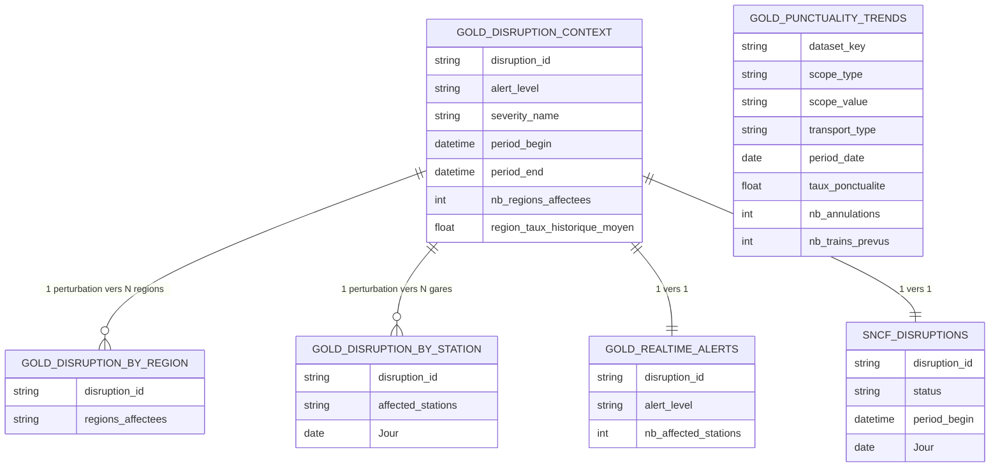

# Modèle de données — Pipeline SNCF

## Structure réelle : table de pont, pas un schéma en étoile classique

Une perturbation touche souvent **plusieurs** régions et **plusieurs** gares
à la fois -- un schéma en étoile classique (1 fait = 1 valeur par dimension)
provoquerait un produit croisé (voir notes/incidents). D'où l'usage de
tables de pont (`by_region`, `by_station`), reliées uniquement à
`gold_disruption_context`, jamais entre elles.

## Note importante -- ce que le diagramme ne montre pas

`GOLD_PUNCTUALITY_TRENDS` est volontairement isolée (aucune relation) --
table historique batch, indépendante du flux temps réel. Les relations
`by_region -> context` et `by_station -> context` existent bien
physiquement, mais en filtrage à sens unique -- `TREATAS` est utilisé en
DAX pour les mesures qui doivent filtrer `context` depuis `by_region`
(voir decisions_architecture.md, section TREATAS du 03/09).
